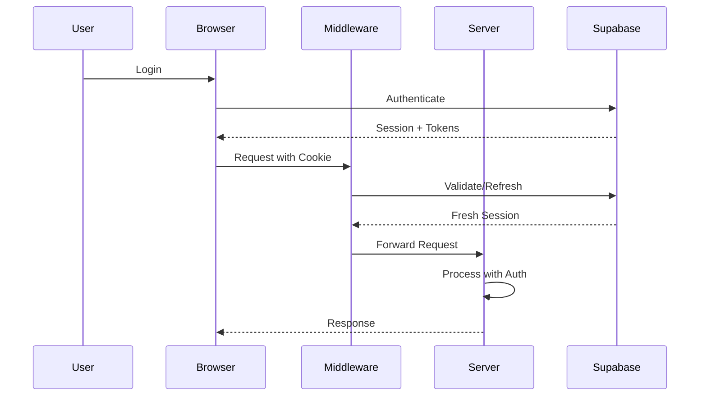

# Supabase SSR Authentication Migration Guide

This guide explains the authentication system after migrating from localStorage to Supabase SSR with HTTP-only cookies.

## Overview

The authentication system now uses:
- **HTTP-only cookies** for secure session storage
- **Server-side authentication** checks in server components
- **Automatic token refresh** via middleware
- **Server actions** for secure mutations

## Key Concepts

### 1. Authentication Flow



### 2. Session Management

Sessions are automatically managed through:
- **Middleware** (`/src/middleware.ts`) - Updates cookies on every request
- **AuthProvider** - Syncs client state with auth events
- **Server Components** - Direct session access during SSR

## Implementation Patterns

### Protected Routes

```typescript
// app/protected/layout.tsx
export default async function ProtectedLayout({
  children,
}: {
  children: React.ReactNode
}) {
  const supabase = await createClient()
  const { data: { user } } = await supabase.auth.getUser()
  
  if (!user) {
    redirect('/auth')
  }
  
  return <>{children}</>
}
```

### Server Actions

```typescript
// app/actions.ts
'use server'

export async function secureAction(data: FormData) {
  const supabase = await createClient()
  const { data: { user } } = await supabase.auth.getUser()
  
  if (!user) {
    throw new Error('Unauthorized')
  }
  
  // Perform secure operation
  return await supabase
    .from('table')
    .insert({ ...data, user_id: user.id })
}
```

### Client Components

```typescript
// components/user-menu.tsx
'use client'

import { useAuth } from '@/hooks/use-auth'

export function UserMenu() {
  const { user } = useAuth()
  
  if (!user) return null
  
  return (
    <div>
      Welcome, {user.email}
    </div>
  )
}
```

### Data Fetching

```typescript
// Server Component
export default async function Page() {
  const supabase = await createClient()
  const { data: emails } = await supabase
    .from('emails')
    .select('*')
    .order('created_at', { ascending: false })
  
  return <EmailList emails={emails} />
}
```

## Critical Implementation Details

### 1. TOKEN_REFRESHED Event Handling

The `AuthProvider` must handle `TOKEN_REFRESHED` events:

```typescript
useEffect(() => {
  const { data: { subscription } } = supabase.auth.onAuthStateChange((event) => {
    if (event === 'TOKEN_REFRESHED') {
      // CRITICAL: This syncs the server session
      router.refresh()
    }
  })
  
  return () => subscription.unsubscribe()
}, [])
```

**Why this matters:**
- Supabase refreshes tokens automatically in the background
- Without `router.refresh()`, server cookies become stale
- Next server action would fail with expired session

### 2. Optimistic Updates

For responsive UI during server mutations:

```typescript
// Use with server actions
const [optimisticEmails, addOptimisticEmail] = useOptimistic(
  emails,
  (state, newEmail) => [...state, newEmail]
)

const [isPending, startTransition] = useTransition()

const handleAction = () => {
  startTransition(async () => {
    addOptimisticEmail(tempEmail)
    await serverAction(data)
    router.refresh()
  })
}
```

### 3. E2E Testing

E2E tests require cookie injection:

```typescript
test('authenticated flow', async ({ page, context }) => {
  // Mock auth cookie
  await context.addCookies([{
    name: 'sb-auth-token',
    value: 'mock-session',
    domain: 'localhost',
    path: '/',
    httpOnly: true,
    secure: false,
    sameSite: 'Lax'
  }])
  
  await page.goto('/protected')
  // Test authenticated behavior
})
```

## Security Best Practices

1. **Never expose tokens** in client code
2. **Always validate** user in server actions
3. **Use RLS policies** for defense in depth
4. **Implement CSRF protection** for forms
5. **Monitor auth events** for suspicious activity

## Common Pitfalls

### 1. Forgetting router.refresh()
```typescript
// ❌ Wrong - Server session becomes stale
onAuthStateChange((event) => {
  if (event === 'TOKEN_REFRESHED') {
    // Missing router.refresh()
  }
})

// ✅ Correct
onAuthStateChange((event) => {
  if (event === 'TOKEN_REFRESHED') {
    router.refresh()
  }
})
```

### 2. Client-side auth checks in protected routes
```typescript
// ❌ Wrong - Client-side protection
'use client'
export default function ProtectedPage() {
  const { user } = useAuth()
  if (!user) redirect('/auth')
  return <div>Protected</div>
}

// ✅ Correct - Server-side protection
export default async function ProtectedPage() {
  const supabase = await createClient()
  const { data: { user } } = await supabase.auth.getUser()
  if (!user) redirect('/auth')
  return <div>Protected</div>
}
```

### 3. Missing auth in server actions
```typescript
// ❌ Wrong - No auth check
export async function deleteEmail(id: string) {
  const supabase = await createClient()
  return await supabase.from('emails').delete().eq('id', id)
}

// ✅ Correct - With auth check
export async function deleteEmail(id: string) {
  const supabase = await createClient()
  const { data: { user } } = await supabase.auth.getUser()
  
  if (!user) {
    throw new Error('Unauthorized')
  }
  
  return await supabase.from('emails').delete().eq('id', id)
}
```

## Migration Checklist

When migrating a component:

- [ ] Remove all localStorage token references
- [ ] Convert to server component if it needs auth
- [ ] Use server actions for mutations
- [ ] Add optimistic updates for UX
- [ ] Update tests to use cookie mocking
- [ ] Verify RLS policies are in place

## Monitoring

Track these metrics:
- Auth event frequency (login/logout/refresh)
- Token refresh rates
- Session errors in middleware
- Failed server actions due to auth

## Further Reading

- [Supabase SSR Documentation](https://supabase.com/docs/guides/auth/server-side-rendering)
- [Next.js App Router Authentication](https://nextjs.org/docs/app/building-your-application/authentication)
- [ADR-0005: SSR Auth Migration](./decisions/0005-supabase-ssr-auth-migration.md)