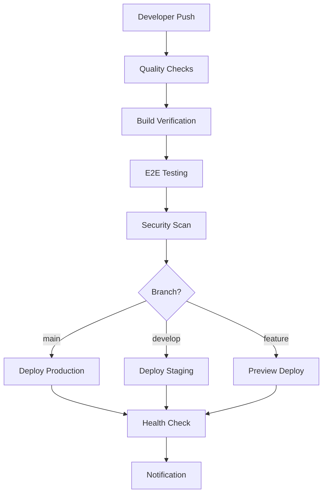

# 🔄 Development Workflow & CI/CD Pipeline

## 🚀 CI/CD Pipeline Overview

Our CI/CD pipeline is designed for Railway deployment with comprehensive quality checks, automated testing, and continuous deployment.

### 🔧 Pipeline Architecture



### 🎯 Pipeline Stages

#### 1. **Quality Checks** 🔍
- **Linting**: ESLint for code quality
- **Type Checking**: TypeScript validation
- **Unit Tests**: Jest/Vitest test execution
- **Dependency Audit**: Security vulnerability scanning

#### 2. **Build Verification** 🏗️
- **Monorepo Build**: `turbo build --filter=@finito/web`
- **Health Check**: Verify `/api/health` endpoint
- **Bundle Analysis**: Check build size and optimization

#### 3. **E2E Testing** 🎭 (PR only)
- **Playwright Tests**: Full user journey testing
- **Console Error Detection**: Capture JavaScript errors
- **Cross-browser Testing**: Chrome, Firefox, Safari
- **Performance Testing**: Core Web Vitals

#### 4. **Security Scanning** 🔒
- **Dependency Audit**: `npm audit`
- **SBOM Generation**: Software Bill of Materials
- **Vulnerability Assessment**: Security risk analysis

#### 5. **Deployment** 🚀
- **Production**: Auto-deploy from `main` branch
- **Staging**: Auto-deploy from `develop` branch
- **Preview**: Manual deploy from feature branches

## 🔄 Development Workflow

### 🌟 Branch Strategy

```
main           (production)   🚀 Auto-deploy to Railway
├── develop    (staging)      🔄 Auto-deploy to Railway staging
├── feature/*  (development)  🧪 Manual deploy for testing
└── hotfix/*   (urgent fixes) 🚨 Fast-track to production
```

### 📋 Development Process

#### 1. **Starting New Work**
```bash
# Create feature branch
git checkout -b feature/email-search-improvements
git push -u origin feature/email-search-improvements

# Start development
npm run dev
```

#### 2. **Development Loop**
```bash
# Make changes
npm run lint          # Check code quality
npm run type-check    # Verify TypeScript
npm run test          # Run unit tests
npm run build         # Verify build success
```

#### 3. **Pre-commit Checks**
```bash
# Run all quality checks
npm run lint && npm run type-check && npm run test

# Test specific app build
npx turbo build --filter=@finito/web

# Optional: Run E2E tests locally
npm run test:e2e
```

#### 4. **Pull Request Process**
```bash
# Push changes
git add .
git commit -m "feat: improve email search with AI-powered suggestions"
git push

# Create PR through GitHub UI
# CI/CD pipeline will automatically run:
# ✅ Quality checks
# ✅ Build verification  
# ✅ E2E testing
# ✅ Security scanning
# ✅ Performance analysis
```

#### 5. **Deployment Process**
```bash
# Merge to develop for staging
git checkout develop
git merge feature/email-search-improvements
git push
# 🔄 Auto-deploys to Railway staging

# Merge to main for production
git checkout main
git merge develop
git push
# 🚀 Auto-deploys to Railway production
```

## 🛠️ Local Development Setup

### 🔧 Prerequisites
- Node.js 18+
- npm 8+
- Git
- Google Cloud Console account

### 🚀 Quick Start
```bash
# Clone repository
git clone <your-repo-url>
cd finito-mail

# Install dependencies
npm install

# Set up environment
cp .env.example .env.local
# Edit .env.local with your Google OAuth credentials

# Start development server
npm run dev
```

### 🧪 Testing Commands
```bash
# Unit tests
npm run test

# E2E tests
npm run test:e2e

# E2E tests with UI
npm run test:e2e:ui

# E2E tests in headed mode
npm run test:e2e:headed
```

### 🔍 Quality Commands
```bash
# Lint all code
npm run lint

# Type check all packages
npm run type-check

# Format code
npm run format

# Clean build artifacts
npm run clean
```

## 🚀 Railway Deployment

### 🔧 Automatic Deployment

**Railway automatically deploys when:**
- Push to `main` branch → Production deployment
- Push to `develop` branch → Staging deployment (if configured)
- All quality checks pass ✅

### 📊 Deployment Process

1. **Trigger**: Push to main branch
2. **CI Pipeline**: All quality checks must pass
3. **Railway Build**: Uses `railway.toml` configuration
4. **Health Check**: Verifies `/api/health` endpoint
5. **Go Live**: Traffic routes to new deployment

### 🩺 Monitoring Deployment

```bash
# Check deployment status
railway logs

# Check service health
curl https://your-app.up.railway.app/api/health

# Monitor application metrics
railway metrics
```

## 🔄 Continuous Integration Features

### 🎯 Branch Protection Rules

Configure these in GitHub Settings > Branches:
- **Require pull request reviews** (1 reviewer)
- **Require status checks** (All CI checks must pass)
- **Require up-to-date branches**
- **Include administrators** (No bypassing)

### 📊 Quality Gates

All PRs must pass:
- ✅ **Linting**: No ESLint errors
- ✅ **Type Checking**: No TypeScript errors  
- ✅ **Tests**: All unit tests pass
- ✅ **Build**: Production build succeeds
- ✅ **Security**: No high/critical vulnerabilities
- ✅ **E2E**: All user journeys work
- ✅ **Performance**: Bundle size within limits

### 🔧 Pipeline Configuration

**Environment Variables in GitHub:**
```bash
# Optional: For Turbo caching
TURBO_TOKEN=your-vercel-token
TURBO_TEAM=your-team-name

# Optional: For advanced deployments
RAILWAY_API_TOKEN=your-railway-token
```

## 🌟 Advanced Workflows

### 🧪 Feature Branch Previews

```bash
# Create preview deployment
railway environment create preview-feature-123
railway deploy --environment preview-feature-123

# Share preview URL with team
echo "Preview: https://preview-feature-123.up.railway.app"
```

### 🚨 Hotfix Process

```bash
# Create hotfix branch from main
git checkout main
git checkout -b hotfix/critical-security-fix

# Make minimal changes
# ... fix the issue ...

# Fast-track to production
git checkout main
git merge hotfix/critical-security-fix
git push
# 🚀 Auto-deploys immediately
```

### 📊 Performance Monitoring

```bash
# Bundle analysis
npm run build
npm run analyze

# Performance testing
npm run test:performance

# Load testing
npm run test:load
```

## 🔧 Development Tools

### 🎯 Recommended VS Code Extensions
- **ESLint**: Code quality
- **Prettier**: Code formatting
- **TypeScript**: Enhanced TS support
- **Tailwind CSS**: Utility-first CSS
- **GitLens**: Git integration
- **Thunder Client**: API testing

### 🧪 Testing Setup
```bash
# Install testing dependencies
npm install --save-dev @playwright/test
npm install --save-dev @testing-library/react

# Configure test scripts
npm run test:setup
```

### 🔍 Debugging Tools
```bash
# Debug build issues
npm run debug:build

# Debug runtime issues
npm run debug:runtime

# Debug E2E tests
npm run debug:e2e
```

## 📈 Performance Optimization

### 🎯 Build Optimization
- **Tree Shaking**: Eliminate unused code
- **Code Splitting**: Dynamic imports
- **Bundle Analysis**: Monitor bundle size
- **Caching**: Efficient build caching

### ⚡ Runtime Optimization
- **Server Actions**: Offload heavy operations
- **Circuit Breakers**: Prevent cascading failures
- **Caching**: Intelligent data caching
- **Monitoring**: Real-time performance metrics

## 🔒 Security Best Practices

### 🛡️ Code Security
- **Dependency Scanning**: Regular security audits
- **Secret Management**: No secrets in code
- **Input Validation**: Zod schemas everywhere
- **CSP Headers**: Content Security Policy

### 🔐 Deployment Security
- **Environment Isolation**: Separate prod/staging
- **Secure Secrets**: Railway environment variables
- **Health Checks**: Verify service health
- **Monitoring**: Security event tracking

## 📊 Monitoring & Observability

### 🎯 Application Metrics
- **Performance**: Response times, throughput
- **Errors**: Error rates, stack traces
- **Usage**: User interactions, feature usage
- **Infrastructure**: CPU, memory, network

### 📈 Business Metrics
- **Email Processing**: Sync rates, success rates
- **User Engagement**: Active users, feature adoption
- **API Performance**: Gmail API usage, quotas
- **Reliability**: Uptime, availability

---

## 🎉 Ready for Continuous Development!

Your Finito Mail project now has:
- ✅ **Automated CI/CD Pipeline**: Quality checks, testing, deployment
- ✅ **Railway Integration**: Seamless production deployment
- ✅ **Quality Gates**: Comprehensive code quality assurance
- ✅ **Security Scanning**: Vulnerability detection and prevention
- ✅ **Performance Monitoring**: Bundle analysis and optimization
- ✅ **Branch Protection**: Enforce quality standards
- ✅ **Preview Deployments**: Test features before production

**Happy coding! 🚀**